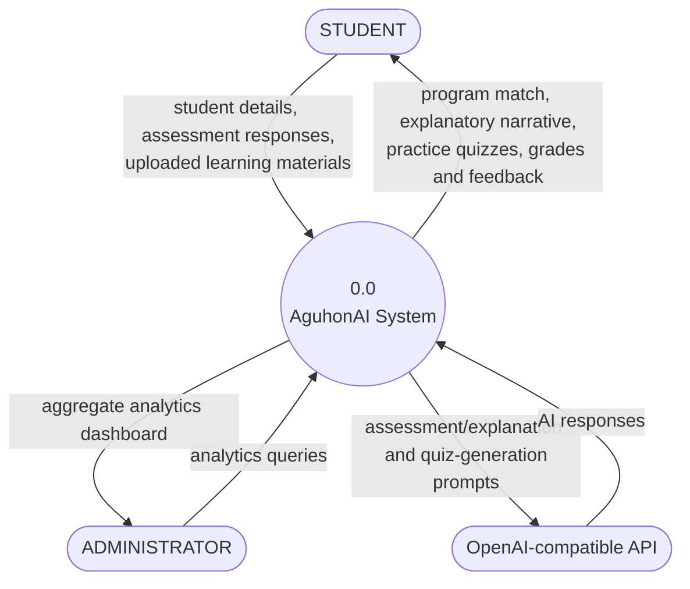

# Data Flow Diagram - Level 0 (Context)

```mermaid
flowchart TD
    S(["STUDENT"])
    C(["ADMINISTRATOR"])
    AI(["OpenAI-compatible API"])
    P0(("0.0<br/>AguhonAI System"))

    S -- "student details, assessment responses,<br/>uploaded learning materials" --> P0
    P0 -- "program match, explanatory narrative,<br/>practice quizzes, grades and feedback" --> S
    C -- "analytics queries" --> P0
    P0 -- "aggregate analytics dashboard" --> C
    P0 -- "assessment/explanation and quiz-generation<br/>prompts" --> AI
    AI -- "AI responses" --> P0
```
