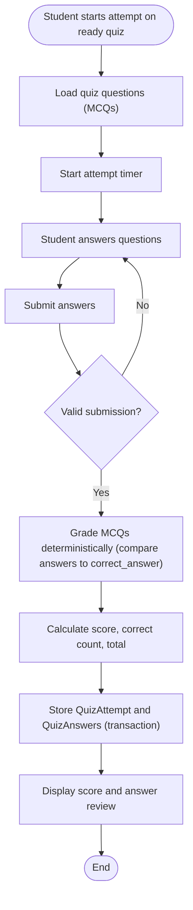

# Quiz Attempt and Grading Flowchart

```mermaid
flowchart TD
    START([Student starts attempt on ready quiz])
    LOAD["Load quiz questions (MCQs)"]
    TIMER["Start attempt timer"]
    ANSWER["Student answers questions"]
    SUBMIT["Submit answers"]
    VALID{Valid submission?}
    GRADE["Grade MCQs deterministically (compare answers to correct_answer)"]
    CALC["Calculate score, correct count, total"]
    STORE["Store QuizAttempt and QuizAnswers (transaction)"]
    REVIEW["Display score and answer review"]
    END([End])

    START --> LOAD --> TIMER --> ANSWER --> SUBMIT --> VALID
    VALID -- "No" --> ANSWER
    VALID -- "Yes" --> GRADE --> CALC --> STORE --> REVIEW --> END
```

**Notes:** MCQs are graded deterministically. The current quiz generator produces 15 MCQs and 10 flashcards; flashcards are for study mode.
