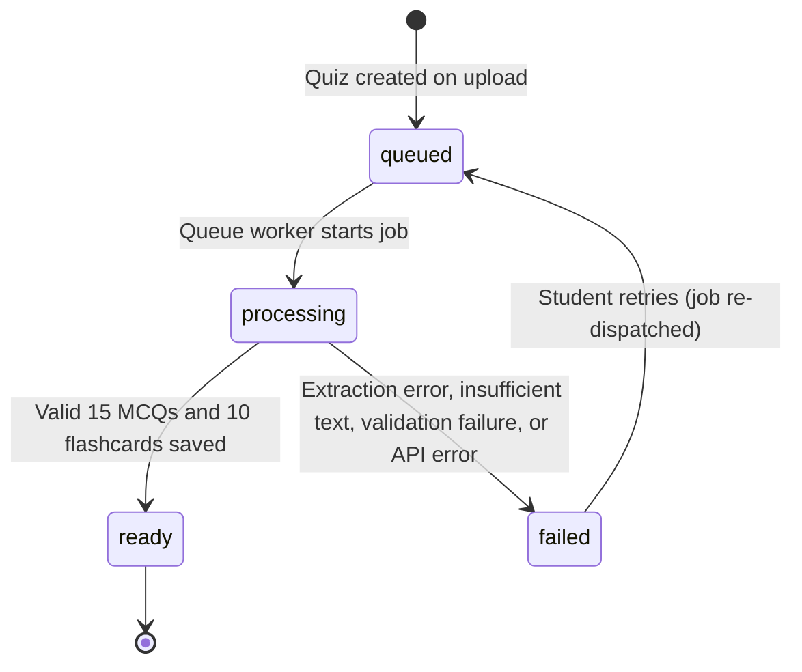

# Quiz Status State Diagram

```mermaid
stateDiagram-v2
    [*] --> queued: Quiz created on upload
    queued --> processing: Queue worker starts job
    processing --> ready: Valid 15 MCQs and 10 flashcards saved
    processing --> failed: Extraction error, insufficient text, validation failure, or API error
    failed --> queued: Student retries (job re-dispatched)
    ready --> [*]
```

**Notes:** States reflect actual Quiz model statuses (queued, processing, ready, failed). Failed quizzes can be retried via re-dispatching the job.
