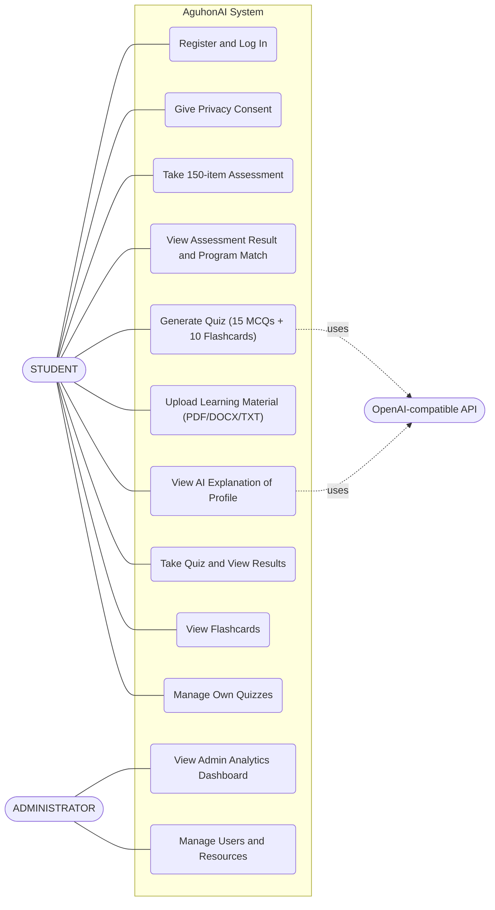

# Use Case Diagram

```mermaid
flowchart LR
    S([STUDENT])
    A([ADMINISTRATOR])
    API([OpenAI-compatible API])

    subgraph SYSTEM["AguhonAI System"]
        UC1("Register and Log In")
        UC2("Give Privacy Consent")
        UC3("Take 150-item Assessment")
        UC4("View Assessment Result and Program Match")
        UC5("View AI Explanation of Profile")
        UC6("Upload Learning Material (PDF/DOCX/TXT)")
        UC7("Generate Quiz (15 MCQs + 10 Flashcards)")
        UC8("Take Quiz and View Results")
        UC9("View Flashcards")
        UC10("Manage Own Quizzes")
        UC11("View Admin Analytics Dashboard")
        UC12("Manage Users and Resources")
    end

    S --- UC1
    S --- UC2
    S --- UC3
    S --- UC4
    S --- UC5
    S --- UC6
    S --- UC7
    S --- UC8
    S --- UC9
    S --- UC10
    A --- UC11
    A --- UC12
    UC7 -. "uses" .-> API
    UC5 -. "uses" .-> API
```
