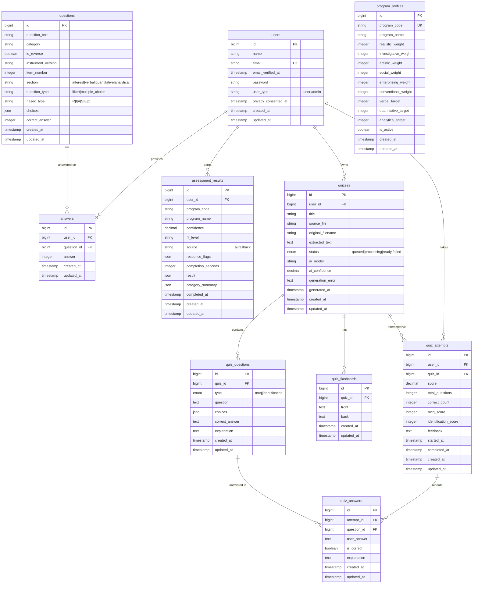

# Entity Relationship Diagram (ERD)

```mermaid
erDiagram
    users {
        bigint id PK
        string name
        string email UK
        timestamp email_verified_at
        string password
        string user_type "user|admin"
        timestamp privacy_consented_at
        timestamp created_at
        timestamp updated_at
    }

    questions {
        bigint id PK
        string question_text
        string category
        boolean is_reverse
        string instrument_version
        integer item_number
        string section "interest|verbal|quantitative|analytical"
        string question_type "likert|multiple_choice"
        string riasec_type "R|I|A|S|E|C"
        json choices
        integer correct_answer
        timestamp created_at
        timestamp updated_at
    }

    answers {
        bigint id PK
        bigint user_id FK
        bigint question_id FK
        integer answer
        timestamp created_at
        timestamp updated_at
    }

    assessment_results {
        bigint id PK
        bigint user_id FK
        string program_code
        string program_name
        decimal confidence
        string fit_level
        string source "ai|fallback"
        json response_flags
        integer completion_seconds
        json result
        json category_summary
        timestamp completed_at
        timestamp created_at
        timestamp updated_at
    }

    program_profiles {
        bigint id PK
        string program_code UK
        string program_name
        integer realistic_weight
        integer investigative_weight
        integer artistic_weight
        integer social_weight
        integer enterprising_weight
        integer conventional_weight
        integer verbal_target
        integer quantitative_target
        integer analytical_target
        boolean is_active
        timestamp created_at
        timestamp updated_at
    }

    quizzes {
        bigint id PK
        bigint user_id FK
        string title
        string source_file
        string original_filename
        text extracted_text
        enum status "queued|processing|ready|failed"
        string ai_model
        decimal ai_confidence
        text generation_error
        timestamp generated_at
        timestamp created_at
        timestamp updated_at
    }

    quiz_questions {
        bigint id PK
        bigint quiz_id FK
        enum type "mcq|identification"
        text question
        json choices
        text correct_answer
        text explanation
        timestamp created_at
        timestamp updated_at
    }

    quiz_flashcards {
        bigint id PK
        bigint quiz_id FK
        text front
        text back
        timestamp created_at
        timestamp updated_at
    }

    quiz_attempts {
        bigint id PK
        bigint user_id FK
        bigint quiz_id FK
        decimal score
        integer total_questions
        integer correct_count
        integer mcq_score
        integer identification_score
        text feedback
        timestamp started_at
        timestamp completed_at
        timestamp created_at
        timestamp updated_at
    }

    quiz_answers {
        bigint id PK
        bigint attempt_id FK
        bigint question_id FK
        text user_answer
        boolean is_correct
        text explanation
        timestamp created_at
        timestamp updated_at
    }

    users ||--o{ answers : "provides"
    questions ||--o{ answers : "answered on"
    users ||--o{ assessment_results : "earns"
    users ||--o{ quizzes : "owns"
    quizzes ||--o{ quiz_questions : "contains"
    quizzes ||--o{ quiz_flashcards : "has"
    quizzes ||--o{ quiz_attempts : "attempted via"
    users ||--o{ quiz_attempts : "takes"
    quiz_attempts ||--o{ quiz_answers : "records"
    quiz_questions ||--o{ quiz_answers : "answered in"
```
